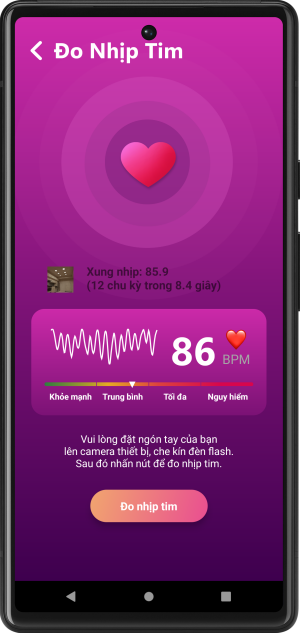

# Introduction

**Team member**
- **Member 1:**
    - **Full name:** Bùi Minh Hoạt
    - **Student ID:** 21020326
    - **University:** VNU Hanoi-University of Engineering and Technology
    - **Mail for work:** official.buiminhhoat@gmail.com
- **Member 2:**
    - **Full name:** Nguyễn Châu Khanh
    - **Student ID:** 21020019
    - **University:** VNU Hanoi-University of Engineering and Technology
    - **Mail for work:** official.nguyenchaukhanh@gmail.com
- **Member 3:**
    - **Full name:** Nguyễn Việt Thắng
    - **Student ID:** 20020474 
    - **University:** VNU Hanoi-University of Engineering and Technology
- **Member 4:**
    - **Full name:** Nguyễn Hữu Hoàng Sơn 
    - **Student ID:** 20020212 
    - **University:** VNU Hanoi-University of Engineering and Technology

# Bài tập lớn UI - Heart Care




## Tài liệu báo cáo

- [Báo cáo ứng dụng Heart Care](https://drive.google.com/file/d/1qrSBLPxwO6S5CNYWR1GCf0GHTqAusuNx/view?usp=sharing)

## Video demo

- [Heart Care](https://www.youtube.com/watch?v=JyoI1qmoC9w)

## Hướng dẫn

1. Chuyển file .env vào backend
2. Vào backend sửa file .env = notepad
```
MYSQL_USER=root
MYSQL_PASSWORD=root
```
thành
```
MYSQL_USER={Tên tài khoản mysql}
MYSQL_PASSWORD={Tên mật khẩu mysql}
```

3. Chạy file Tạo database.bat 1 lần

4. Chạy file Chạy server dev cổng 3000.bat để mở server dev ở local

5. Chạy file IPv4.bat để lấy ip server và lưu lại giá trị này

6. Mở Backend.java trong frontend chỉnh serverUrl theo giá trị lấy được ở trên

7. Chạy android emulator để mở ứng dụng

TK mặc định 
```
user@gmail.com 
user@gmail.com
```
